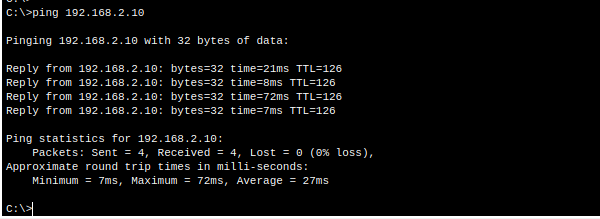

Voici le contenu corrigé en **format `.md` prêt à copier-coller** dans ton fichier Markdown (`.md`) :

# PRA (Plan de Reprise d’Activité)

## **Plan d’adressage IP**

| Périphérique / Interface        | IP Address     | Subnet          |
|----------------------------------|----------------|------------------|
| PC1                             | 192.168.1.10   | 255.255.255.0   |
| SW1                             | Pas d'IP (non géré) |              |
| R1 (LAN vers SW1) - G0/0        | 192.168.1.1    | 255.255.255.0   |
| R1 (WAN principal) - S0/0/0     | 10.0.0.1       | 255.255.255.252 |
| R1 (WAN secours) - S0/0/1       | 10.0.0.5       | 255.255.255.252 |
| R2 (WAN principal) - S0/0/0     | 10.0.0.2       | 255.255.255.252 |
| R2 (WAN secours) - S0/0/1       | 10.0.0.6       | 255.255.255.252 |
| R2 (LAN vers SW2) - G0/0        | 192.168.2.1    | 255.255.255.0   |
| PC2                             | 192.168.2.10   | 255.255.255.0   |


### PC1

```

IP: 192.168.1.10  
Mask: 255.255.255.0  
Gateway: 192.168.1.1

```

### PC2


IP: 192.168.2.10  
Mask: 255.255.255.0  
Gateway: 192.168.2.1


### Configuration des équipements

- [conftr1_pra.txt](./image/conftr1_pra.txt)
- [conftr2_pra.txt](./image/conftr2_pra.txt)
- [conftsw1_pra.txt](./image/conftsw1_pra.txt)
- [conftsw2_pra.txt](./image/conftsw2_pra.txt)


## Ping v1

💡 Je peux ping PC2 depuis PC1  


💡 Je peux ping PC1 depuis PC2  


💡 Avec cette configuration présente  


## Ping v2

💡 Je peux ping PC2 depuis PC1 avec un câble en moins car le second câble DCE a pris le relais  


💡 Je peux ping PC1 depuis PC2 avec un câble en moins car le second câble DCE a pris le relais  


## Annexes

  


📎 [Télécharger le fichier PRA.pkt](./image/PRA.pkt)
